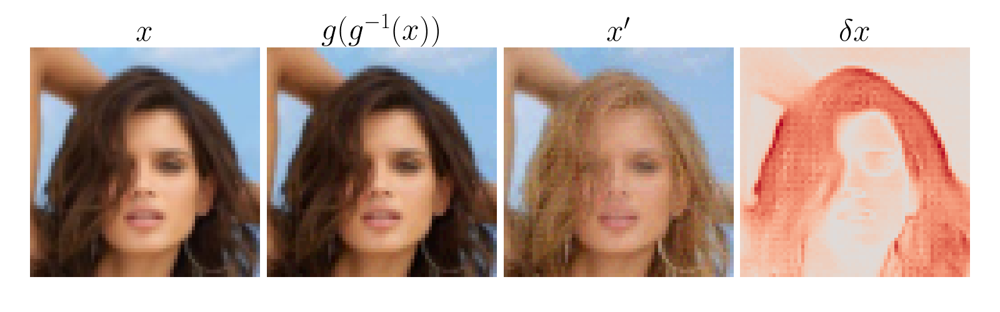
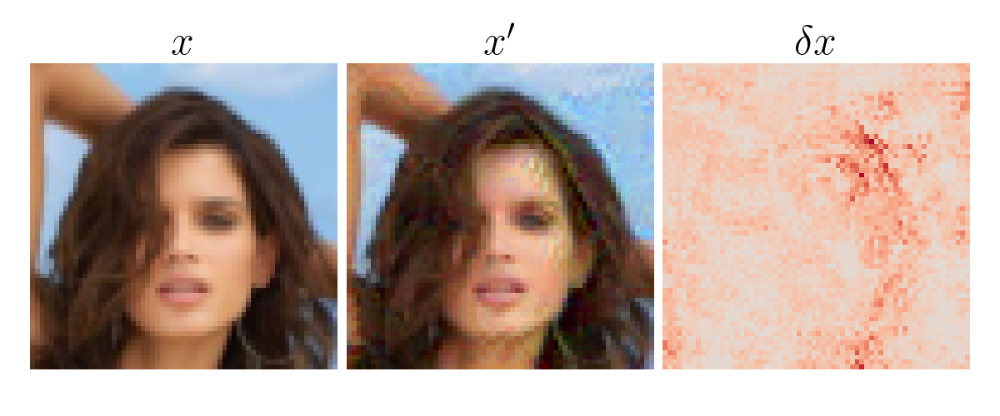

# Counterfactuals

We create counterfactual explanations for image data by doing gradient ascent in the latent space of a generative model.
Our method finds counterfactuals that are structurally different from the original image and resemble samples from the target class.
For the example shown below we start from the original image *x* that is classified as *not blond*. The second column shows the image after encoding and decoding with the generative model, illustrating the quality of the reconstruction of the latent space representation *z* of *x*. We run gradient decent, optimizing *z* until the decoded modified image *x'* is classified as blond with a confidence of 0.99.
The resulting counterfactual shows the same person as in the original image but with blond hair. The heatmap highlights the pixels that changed most in red.



This is in stark contrast to the conventional adversarial examples found by doing gradient ascent in the image space. The modified image *x'* is also classified as blond with confidence 0.99, but to a human observer the image looks very much like the original and only unstructured noise was added.



We test our method on different data sets
- MNIST (hand written digits)
- CelebA (celebrity faces)
- CheXpert (chest x-rays)
- Mall (pedestrians in a shopping mall)

using different generative models
- Normalizing Flows (realNVP and Glow)
- Generative Adversarial Networks (progressive GAN and deep convolutional GAN)
- Variational Auto-Encoder (convolutional VAE)

and different (classification) models leading the gradient ascent updates
- 10 class classifier for MNIST
- binary classifiers (blond/not-blond for CelebA and cardiomegaly/healthy for CheXpert)
- a U-Net for the number of pedestrians present in Mall images

### Install
Navigate to the cloned directory and excecute
```
python setup.py install
```

### Download
The pretrained networks can be downloaded from
```
https://drive.google.com/drive/folders/1PKfKie1KHKRHuZhjSwwiVsCYMitZFvjV?usp=sharing
```

### Run
Conventional adversarial examples can be produced with the following code:
```
############################
# conventional adv attacks #
############################

# MNIST
python main.py main data-set --name MNIST classifier adv-attack --image_path images/MNIST_img_1.png --target_class 9 --lr 5e-4 --attack_style conv --num_steps 2000 --save_at 0.99
# CelebA
python main.py main data-set --name CelebA classifier --path checkpoints/classifiers/CelebA_CNN_9.pth adv-attack --image_path images/CelebA_img_1.png --target_class 1 --lr 7e-4 --num_steps 1000 --save_at 0.99 --attack_style conv
# CheXpert
python main.py main data-set --name CheXpert classifier adv-attack --image_path images/CheXpert_img_1.png --target_class 1 --lr 5e-4 --num_steps 1000 --save_at 0.99 --attack_style conv
# Mall
python main.py main data-set --name Mall classifier --path checkpoints/classifiers/Mall_UNet_ultrasmall.pth adv-attack --image_path images/Mall_img_1.png --lr 1e-4 --num_steps 5000 --save_at 10 --maximize True --attack_style conv
python main.py main data-set --name Mall classifier --path checkpoints/classifiers/Mall_UNet_ultrasmall.pth adv-attack --image_path images/Mall_img_2.png --lr 1e-4 --num_steps 5000 --save_at 0.01 --maximize False --attack_style conv

```
Counterfactuals can be produced with the following code:
```
###################
# counterfactuals #
###################

# Normalizing Flows
# MNIST realNVP
python main.py main data-set --name MNIST classifier generative-model --g_type Flow adv-attack --image_path images/MNIST_img_1.png --target_class 9 --lr 5e-2 --num_steps 2000 --save_at 0.99
# CelebA Glow
python main.py main data-set --name CelebA classifier --path checkpoints/classifiers/CelebA_CNN_9.pth generative-model --g_type Flow adv-attack --image_path images/CelebA_img_1.png --target_class 1 --lr 5e-3 --num_steps 1000 --save_at 0.99
# CheXpert Glow
python main.py main data-set --name CheXpert classifier generative-model --g_type Flow adv-attack --image_path images/CheXpert_img_1.png --target_class 1 --lr 5e-3 --num_steps 1000 --save_at 0.99
# Mall Glow
python main.py main data-set --name Mall classifier --path checkpoints/classifiers/Mall_UNet_ultrasmall.pth generative-model --g_type Flow adv-attack --image_path images/Mall_img_1.png --lr 5e-3 --num_steps 5000 --save_at 10 --maximize True
python main.py main data-set --name Mall classifier --path checkpoints/classifiers/Mall_UNet_ultrasmall.pth generative-model --g_type Flow adv-attack --image_path images/Mall_img_2.png --lr 5e-3 --num_steps 5000 --save_at 0.01 --maximize False

# GANs
# MNIST dcGAN
python main.py main data-set --name MNIST classifier generative-model --g_type GAN adv-attack --image_path images/MNIST_img_1.png --target_class 9 --lr 5e-3 --num_steps 1000
# CelebA pGAN
python main.py main data-set --name CelebA classifier --path checkpoints/classifiers/CelebA_CNN_9.pth generative-model --g_type GAN adv-attack --image_path images/CelebA_img_1.png --target_class 1 --lr 5e-3 --num_steps 1000

# VAEs
# MNIST
python main.py main data-set --name MNIST classifier generative-model --g_type VAE adv-attack --image_path images/MNIST_img_1.png --target_class 9 --num_steps 1000 --lr 5e-3

```

When using this Code please cite

```
@inproceedings{dombrowski2021diffeomorphic,
  title={Diffeomorphic Explanations with Normalizing Flows},
  author={Dombrowski, Ann-Kathrin and Gerken, Jan E and Kessel, Pan},
  booktitle={ICML Workshop on Invertible Neural Networks, Normalizing Flows, and Explicit Likelihood Models},
  year={2021}
}

@misc{dombrowski2022diffeomorphic,
  doi = {10.48550/ARXIV.2206.05075},
  url = {https://arxiv.org/abs/2206.05075},
  author = {Dombrowski, Ann-Kathrin and Gerken, Jan E. and Müller, Klaus-Robert and Kessel, Pan},
  title = {Diffeomorphic Counterfactuals with Generative Models},
  publisher = {arXiv},
  year = {2022},
}

```


### License

This repository is licensed under the Apache License, Version 2.0. See [LICENSE](LICENSE) for the full license text.
