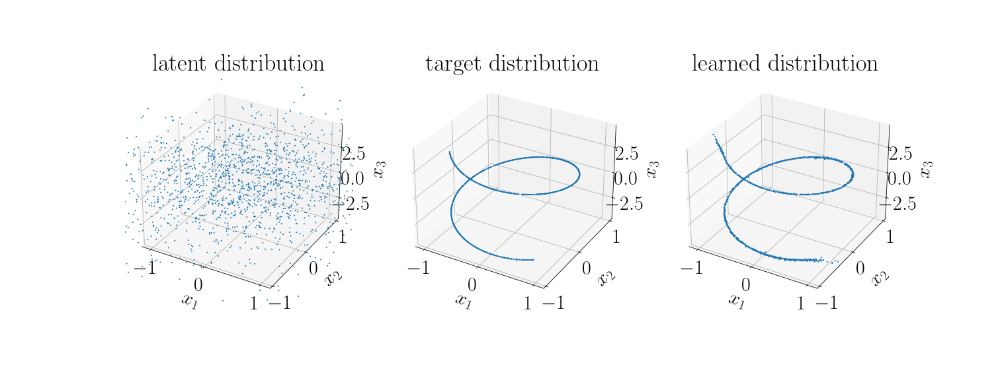
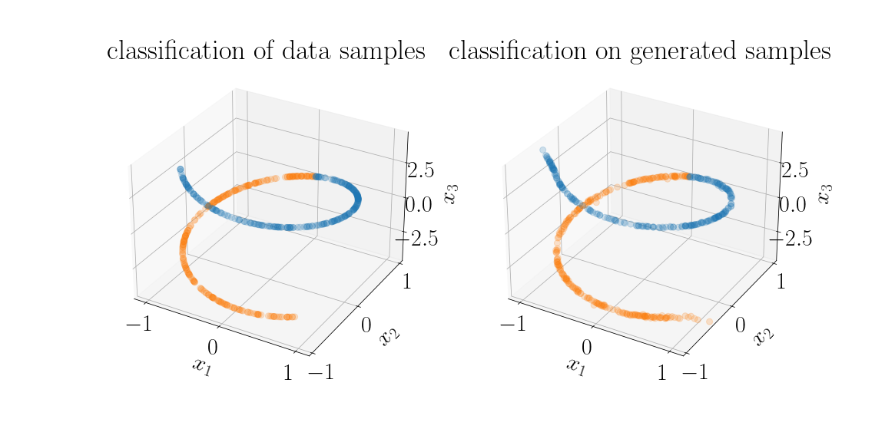
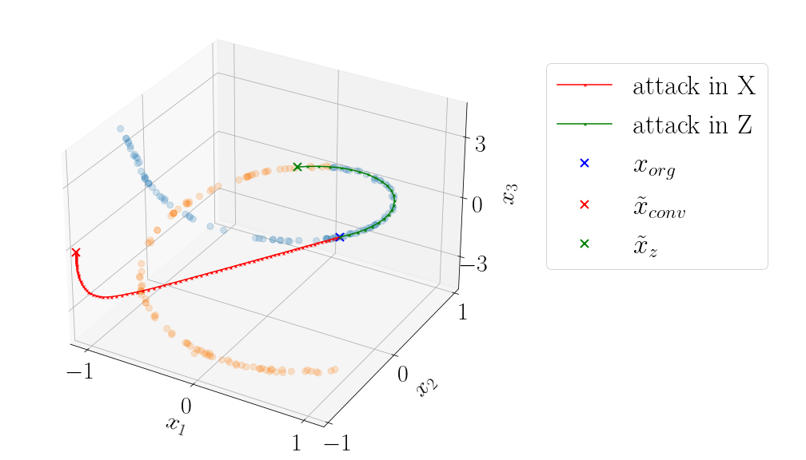
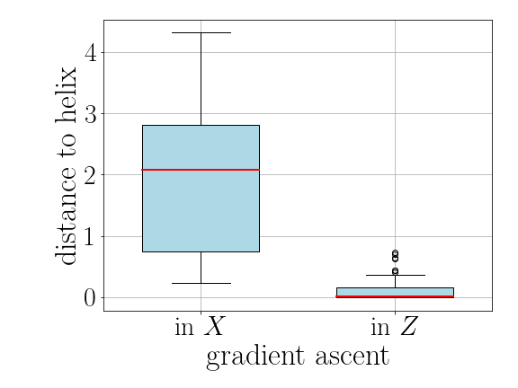

# HelixFlow

In this notebook we start from a data distribution that lies on a helix embedded in three dimensional space. We train a simple normalizing flow to approximate the data distribution (pretrained models can be downloaded from https://drive.google.com/drive/folders/1PKfKie1KHKRHuZhjSwwiVsCYMitZFvjV?usp=sharing).

We then define a classifier that divides the data points in two classes.

Using the classifier *f* we can generate adversarial examples by doing gradient ascent in the data space *X*. We usually walk off data manifold when we simply follow the gradient 
. Alternatively we can do gradient ascent in the base space *Z* of the flow *g*. With that we are following the gradient 
. When we project back into the data space 
 we can see that we stay (approximately) on the data manifold.

We varify this by calculating the distances to the datamanifold for both adversarial examples and counterfactuals for many datapoints.

